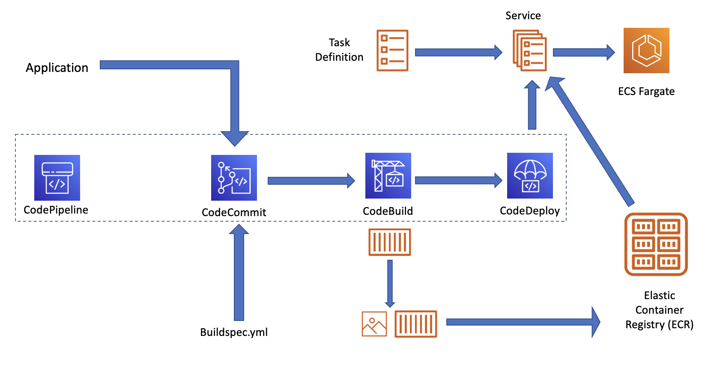

In this project, I built a simple HTML page consisting of a few K8s/container memes. I then implemented a full code pipeline incorporating commit, build and deploy stages.

## What I Learnt

 - CodeCommit
 - CodeBuild
 - CodePipeline
 - ECS (Fargate)
 - Creating a pipeline on AWS

## Process

Here's the architectural diagram of what I created:

1. The first step was to create a CodeCommit repository and link it to a local repository. This was easily done by uploading a public key to the IAM CodeCommit credentials, creating a new repo and then cloning it locally.
2. The next step was to configure the Elastic Container Registry. A private registry was created to store the Docker image that would be created by CodeBuild.
3. Then a CodeBuild project was created to take what's in the CodeCommit repo, build it and store in the ECR repo created in the previous step. The buildspec.yaml file was then created in the local repo to tell codebuild the steps involved in the build process.
4. The next step was to create a pipeline using CodePipeline and incorporate the CodeCommit and CodeBuild steps within so as to create a continuous build process. 
5. Then, a load balancer was created as the entry point of the containerized application. A ECS Fargate was created along with task and container definitions. A service was also created to run 2 tasks and the formerly created load balancer was picked as the entry point.
6. Finally, a deploy step was added to CodePipeline to deploy it to the service created above.
